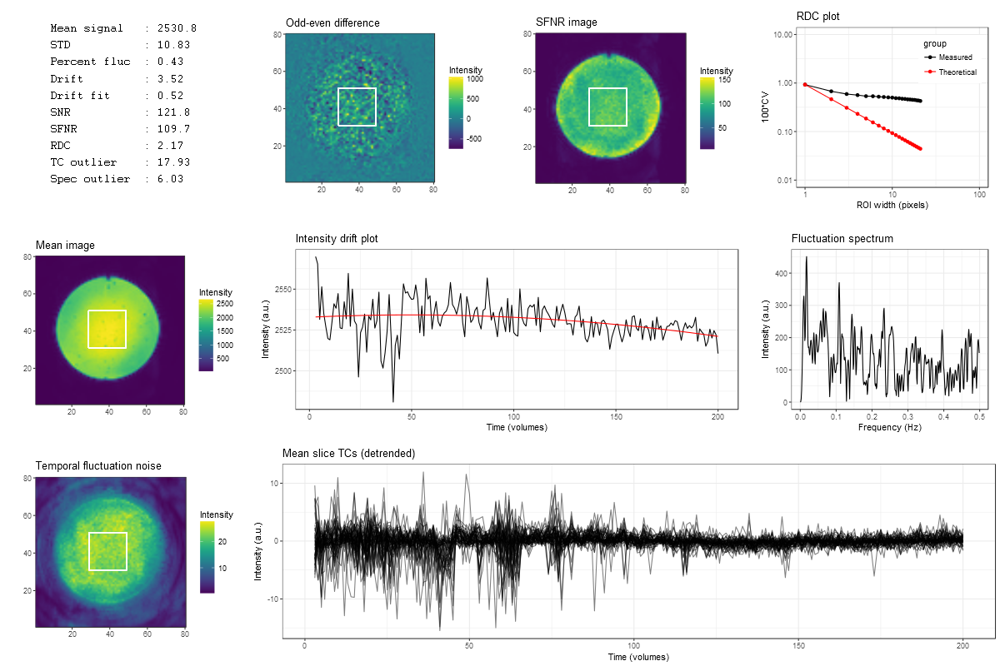

<!-- README.md is generated from README.Rmd. Please edit that file -->

fmriqa
======

## Overview
The fmriqa package provides an implemenation of the fMRI QA analysis protocol
detailed in:

Friedman L and Glover GH. Report on a multicenter fMRI quality assurance 
protocol. J Magn Reson Imaging. 2006 Jun;23(6):827-39.

## Installation
You can install the stable version of fmriqa from CRAN:
```{r cran, eval = FALSE}
install.packages("fmriqa", dependencies = TRUE)
```

Or the the development version from GitHub (requires `devtools` package):
```{r github, eval = FALSE}
install.packages("devtools")
devtools::install_github("martin3141/fmriqa")
```

## Usage
```{r basic, eval = FALSE}
# load the package
library(fmriqa)

# get help on the options for run_qa
?run_qa

# run the analysis - a file chooser will appear when a data_file argument is not given
run_qa()
```

## Simualated example
```{r simulate, eval = TRUE}
library(fmriqa)
library(oro.nifti)

# generate random data
set.seed(1)
sim_data <- array(rnorm(80 * 80 * 11 * 100), dim = c(80, 80, 11, 100))
sim_data[20:60, 20:60, 6, ] <- sim_data[20:60, 20:60, 6, ] + 50
sim_nifti <- oro.nifti::as.nifti(sim_data)
fname <- tempfile()
writeNIfTI(sim_nifti, fname)

# perform qa
res <- run_qa(fname)
res$snr
```

## Plot output from real data showing RF spiking artifact


