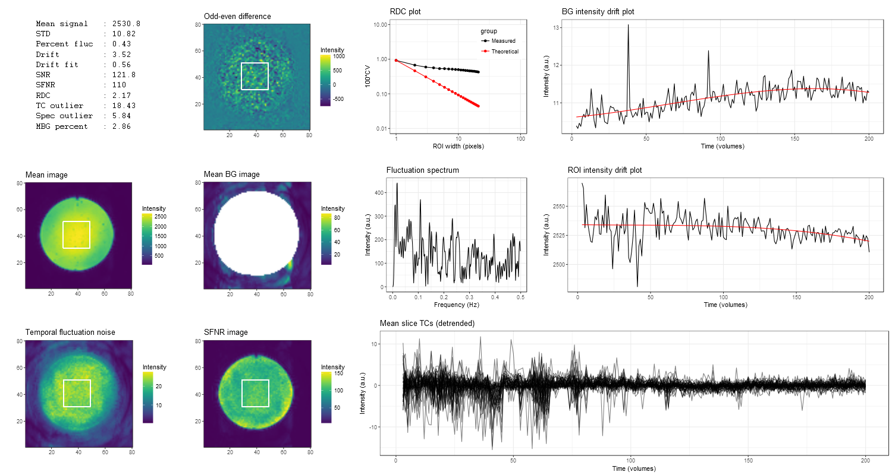

<!-- README.md is generated from README.Rmd. Please edit that file -->

fmriqa
======

[](https://travis-ci.org/martin3141/fmriqa)
[](https://ci.appveyor.com/project/martin3141/fmriqa)
[](http://cran.rstudio.com/web/packages/fmriqa/index.html)
[](https://cran.r-project.org/package=fmriqa)
[](https://coveralls.io/r/martin3141/fmriqa?branch=master)

## Overview
The fmriqa package provides an implemenation of the fMRI quality assurance (QA) 
analysis protocol detailed by Friedman and Glover (2006) 
<doi:10.1002/jmri.20583>.

## Installation
You can install the stable version of fmriqa from CRAN:
```{r cran, eval = FALSE}
install.packages("fmriqa", dependencies = TRUE)
```

Or the the development version from GitHub (requires `devtools` package):
```{r github, eval = FALSE}
install.packages("devtools")
devtools::install_github("martin3141/fmriqa")
```

## Usage
```{r basic, eval = FALSE}
# load the package
library(fmriqa)

# get help on the options for run_fmriqa
?run_fmriqa

# run the analysis - a file chooser will appear when a data_file argument is not given
run_fmriqa()
```

## Real data example
```{r real_data, eval = TRUE}
library(fmriqa)
fname <- system.file("extdata", "qa_data.nii.gz", package = "fmriqa")
res <- run_fmriqa(data_file = fname, gen_png = FALSE, gen_res_csv = FALSE, tr = 3)
```

## Simulation example
```{r simulate, eval = TRUE}
library(fmriqa)
library(oro.nifti)

# generate random data
set.seed(1)
sim_data <- array(rnorm(80 * 80 * 1 * 100), dim = c(80, 80, 1, 100))
sim_data[20:60, 20:60, 1, ] <- sim_data[20:60, 20:60, 1, ] + 50
sim_nifti <- oro.nifti::as.nifti(sim_data)
fname <- tempfile()
writeNIfTI(sim_nifti, fname)

# perform qa
res <- run_fmriqa(fname, gen_png = FALSE, gen_res_csv = FALSE)
res$snr
```

## Plot output from real data showing RF spiking artifact


