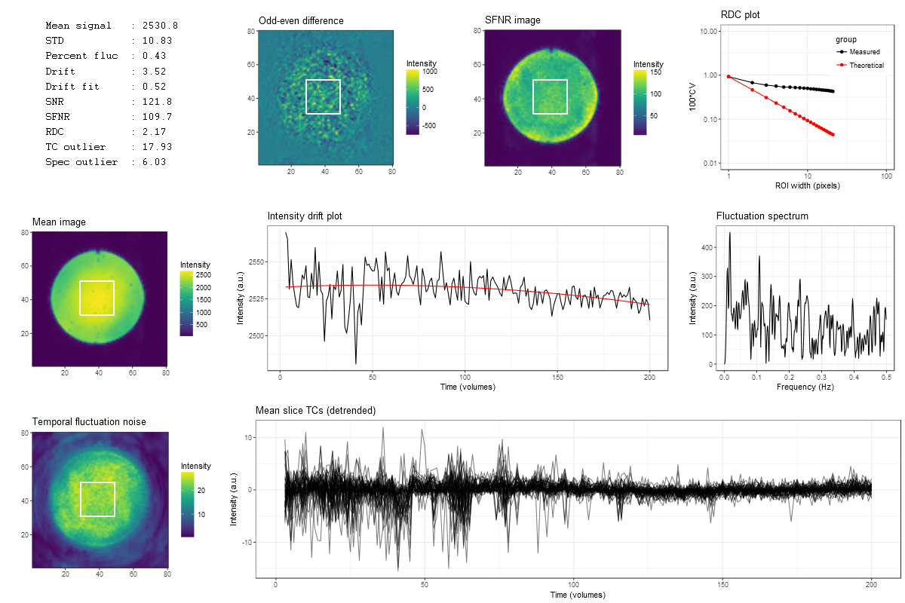

<!-- README.md is generated from README.Rmd. Please edit that file -->

# fmriqa

[](https://cran.r-project.org/package=fmriqa)

## Overview

The fmriqa package provides an implementation of the fMRI quality
assurance (QA) analysis protocol detailed by Friedman and Glover (2006)
<doi:10.1002/jmri.20583>.

## Installation

You can install the stable version of fmriqa from CRAN:

``` r
install.packages("fmriqa", dependencies = TRUE)
```

Or the the development version from GitHub (requires `devtools`
package):

``` r
install.packages("devtools")
devtools::install_github("martin3141/fmriqa")
```

## Usage

``` r
# load the package
library(fmriqa)

# get help on the options for run_fmriqa
?run_fmriqa

# run the analysis - a file chooser will appear when a data_file argument is not given
run_fmriqa()
```

## Real data example

``` r
library(fmriqa)
fname <- system.file("extdata", "qa_data.nii.gz", package = "fmriqa")
res <- run_fmriqa(data_file = fname, gen_png = FALSE, gen_res_csv = FALSE,
                  tr = 3, bg_shrink = 15)
```

    ## Reading data  : /home/martin/R/x86_64-pc-linux-gnu-library/4.5/fmriqa/extdata/qa_data.nii.gz
    ## 
    ## Basic analysis parameters
    ## -------------------------
    ## X,Y matrix     : 80x80
    ## Slices         : 1
    ## X,Y,Z pix dims : 1x1x1mm
    ## TR             : 3s
    ## Slice #        : 1
    ## ROI width      : 21
    ## Total vols     : 200
    ## Analysis vols  : 198
    ## 
    ## QA metrics
    ## ----------
    ## Mean signal   : 2561.3
    ## STD           : 6.4
    ## Percent fluc  : 0.25
    ## Drift         : 2.06
    ## Drift fit     : 1.42
    ## SNR           : 141.3
    ## SFNR          : 137
    ## RDC           : 2.84
    ## TC outlier    : 2.66
    ## Spec outlier  : 5.12
    ## MBG percent   : 1.14

## Simulation example

``` r
library(fmriqa)
library(oro.nifti)
```

    ## oro.nifti 0.11.4

``` r
# generate random data
set.seed(1)
sim_data <- array(rnorm(80 * 80 * 1 * 100), dim = c(80, 80, 1, 100))
sim_data[20:60, 20:60, 1, ] <- sim_data[20:60, 20:60, 1, ] + 50
sim_nifti <- oro.nifti::as.nifti(sim_data)
fname <- tempfile()
writeNIfTI(sim_nifti, fname)
```

    ## [1] "/tmp/RtmpLjqgDg/file4ed26471dbfd.nii.gz"

``` r
# perform qa
res <- run_fmriqa(fname, gen_png = FALSE, gen_res_csv = FALSE, t1_canny = 1,
                  t2_canny = 2)
```

    ## Reading data  : /tmp/RtmpLjqgDg/file4ed26471dbfd
    ## 
    ## Basic analysis parameters
    ## -------------------------
    ## X,Y matrix     : 80x80
    ## Slices         : 1
    ## X,Y,Z pix dims : 1x1x1mm
    ## TR             : 1s
    ## Slice #        : 1
    ## ROI width      : 21
    ## Total vols     : 100
    ## Analysis vols  : 98
    ## 
    ## QA metrics
    ## ----------
    ## Mean signal   : 50
    ## STD           : 0.05
    ## Percent fluc  : 0.09
    ## Drift         : 0.45
    ## Drift fit     : 0.06
    ## SNR           : 51.7
    ## SFNR          : 51.2
    ## RDC           : 21.77
    ## TC outlier    : 2.74
    ## Spec outlier  : 4.04
    ## MBG percent   : 0.07

``` r
res$snr
```

    ## [1] 51.74954

## Plot output from real data showing RF spiking artifact


